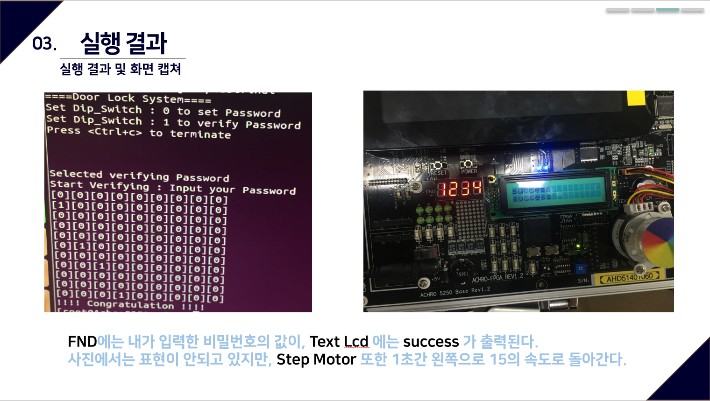
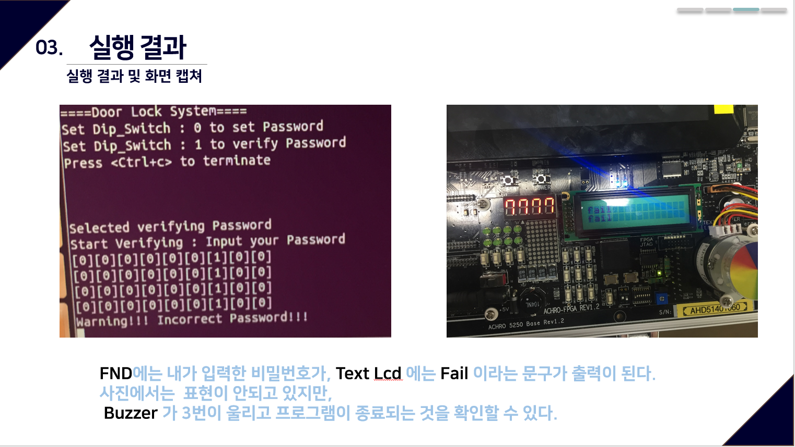

# 2018-Embedded-System-Achro5250
2018 KPU Embedded System lecture Project Using Achro-5250

디바이스드라이버를 이용하여 비밀번호를 등록하고, 해당 비밀번호를 검증하는 도어락의 기능을 수행하는 프로그램 구현

1) Achro-5250보드의디바이스드라이버를 1개이상개선한후, 최소 3개이상의디바이스를이용한응용프로그램의설계및구현

  여러 버튼으로 입력을 할 수 있는 유일한 Push Switch를 이용하여, 기존의 정해진 시간에 맞추어 출력만 하는 Push Switch 코드를, 사용자가 원하는 입력 값을 받고 저장하여 이용할 수 있는 입력버튼의 역할로 설계하였다. (디바이스 드라이버 개선사항)

2) Dip Switch, Push Switch, Fnd, Text Lcd, Step Motor, Buzzer를 활용

3) 구성도 

  비밀번호 모드 확인 -> 비밀번호 설정 -> 비밀번호 검증 -> 일치 액션 or 불일치 액션
  
이 프로그램은 Dip Switch로 모드를 나누고 첫 번째 딥스위치만 내려가있을때 즉, 딥스위치 값이 1일때 비밀번호 검증모드로 들어가게 되고 딥스위치가 전부 올라가있는 즉, 딥스위치 값이 0일땐 비밀번호 생성(세팅)모드로 들어가지게 된다. 처음 실행 시 비밀번호 세팅모드로 들어가서 비밀번호를 Push_switch를 통해 입력하면 해당 디렉토리안에 passwd.txt 파일이 생성되며 프로그램이 종료된다. 그 후 비밀번호 검증모드로 들어가서 비밀번호 입력 시 이전에 등록한 passwd.txt 안의 비밀번호와 대조해 일치 여부를 확인시켜준다. 일치 시에는 도어락 잠금장치가 풀리는 것을 스텝모터(Step Motor)가 돌아가는 것을 통해 보여주고 불일치 시에는 경고음(Buzzer)가 울린다. 

실제 실행화면
1) 일치 시

2) 불일치 시

